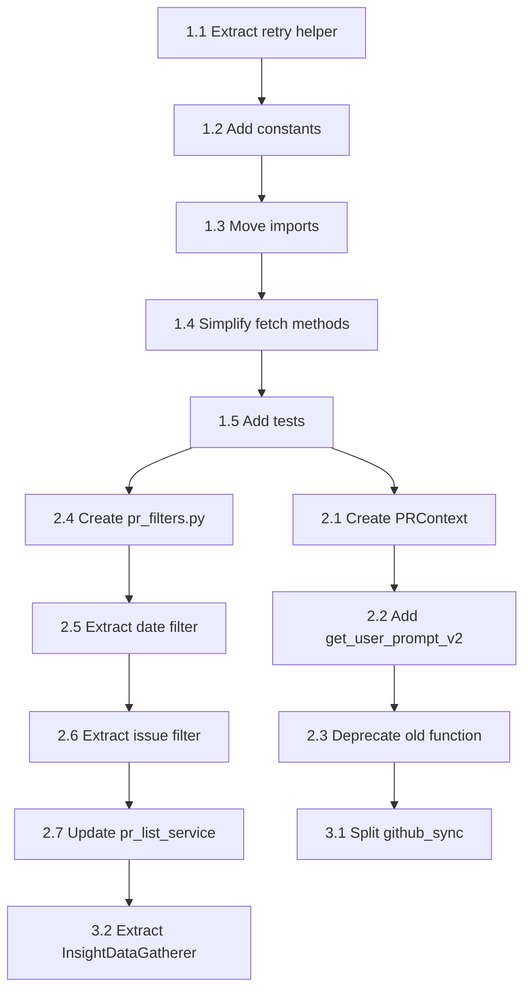

# Code Simplification - Context & Reference

**Last Updated:** 2026-01-11
**Phase 1 Status:** ✅ COMPLETED with Full TDD Coverage

---

## Phase 1 Completion Summary

**Completed:** 2026-01-11

### Changes Made
1. **Module-level imports**: Moved `import asyncio` to top of file (removed 5 inline imports)
2. **Named constants added**: `DEFAULT_TIMEOUT_SECONDS`, `DEFAULT_MAX_RETRIES`, `DEFAULT_MAX_WAIT_SECONDS`, `GRAPHQL_RATE_LIMIT_POINTS`
3. **Extracted `_execute_with_retry()` helper**: ~55 lines centralizing retry/rate-limit/error logic
4. **Simplified 5 fetch methods**: Each reduced from 50-90 lines to 15-30 lines
5. **Added 8 TDD unit tests**: Full coverage of `_execute_with_retry()` behavior

### Metrics
| Metric | Before | After |
|--------|--------|-------|
| File lines | 1,066 | 1,000 |
| Duplicated retry logic | 5 methods (~230 lines) | 1 helper (~55 lines) |
| Tests | 60 | 68 (+8 TDD) |
| All tests passing | ✅ | ✅ |

### TDD Test Coverage (`TestExecuteWithRetry`)
- `test_execute_with_retry_returns_result_on_success`
- `test_execute_with_retry_passes_rate_limit_error_through_immediately`
- `test_execute_with_retry_retries_on_timeout_then_succeeds`
- `test_execute_with_retry_raises_timeout_error_after_max_retries`
- `test_execute_with_retry_converts_generic_exception_to_graphql_error`
- `test_execute_with_retry_uses_exponential_backoff`
- `test_execute_with_retry_respects_max_retries_parameter`
- `test_execute_with_retry_preserves_original_exception_as_cause`

---

## Key Files

### Phase 1: github_graphql.py ✅ COMPLETED
| File | Purpose | Lines | Status |
|------|---------|-------|--------|
| `apps/integrations/services/github_graphql.py` | GraphQL client with retry logic | 1,000 | ✅ Refactored |
| `apps/integrations/services/github_graphql_sync/*.py` | Sync orchestration | ~2,000 | Reference only |
| `apps/integrations/tests/test_github_graphql.py` | Tests for GraphQL client | ~450 | ✅ +8 TDD tests |

### Phase 2: pr_list_service.py & llm_prompts.py
| File | Purpose | Lines | Status |
|------|---------|-------|--------|
| `apps/metrics/services/pr_list_service.py` | PR filtering and queries | 612 | To refactor |
| `apps/metrics/services/llm_prompts.py` | LLM prompt building | 722 | To refactor |
| `apps/metrics/types.py` | Type definitions | ~150 | To extend |
| `apps/metrics/services/pr_filters.py` | Filter utilities (NEW) | 0 | To create |
| `apps/metrics/tests/services/test_pr_list_service.py` | Filter tests | ~300 | Update after |

### Phase 3: Major Refactoring
| File | Purpose | Lines | Status |
|------|---------|-------|--------|
| `apps/integrations/services/github_sync.py` | REST sync service | 1,148 | To split |
| `apps/metrics/services/insight_llm.py` | Insight generation | 802 | To refactor |
| `apps/metrics/services/insight_data.py` | Data gatherer (NEW) | 0 | To create |

---

## Critical Code Sections

### 1. Retry Logic Pattern (github_graphql.py) ✅ REFACTORED

**Location:** `_execute_with_retry()` method at line ~590

**Status:** COMPLETED - The duplicated pattern was extracted into a centralized helper.

```python
# NEW: Centralized helper (replaces ~230 lines of duplication)
async def _execute_with_retry(
    self,
    query,
    variables: dict,
    operation_name: str,
    max_retries: int = DEFAULT_MAX_RETRIES,
) -> dict:
    """Execute GraphQL query with retry logic and rate limit checking."""
    last_error = None
    for attempt in range(max_retries):
        try:
            result = await self._execute(query, variable_values=variables)
            await self._check_rate_limit(result, operation_name)
            return result
        except GitHubGraphQLRateLimitError:
            raise
        except TimeoutError as e:
            last_error = e
            if attempt < max_retries - 1:
                wait_time = 2**attempt  # Exponential backoff: 1s, 2s, 4s
                logger.warning(f"Timeout during {operation_name}...")
                await asyncio.sleep(wait_time)
            else:
                raise GitHubGraphQLTimeoutError(...) from e
        except Exception as e:
            raise GitHubGraphQLError(...) from e
    raise GitHubGraphQLTimeoutError(...) from last_error
```

**TDD Coverage:** 8 dedicated unit tests in `TestExecuteWithRetry` class

### 2. God Function (pr_list_service.py)

**Location:** Lines 82-362

```python
def get_prs_queryset(team, filters=None, prefetch=True):
    """280 lines with 20+ filter branches."""
    # Base query + annotations (lines 103-131)
    # Repository filter (lines 134-136)
    # Author filters (lines 139-154)
    # Reviewer filters (lines 161-209)
    # AI filters (lines 212-226)
    # Size filter (lines 229-236)
    # State/draft filters (lines 239-254)
    # Tech category filter (lines 259-268)
    # LLM filters (lines 271-280)
    # Date range filter (lines 286-317)
    # Issue type filter (lines 326-360)
```

### 3. Parameter Explosion (llm_prompts.py)

**Location:** Lines 146-176

```python
def get_user_prompt(
    title: str,
    body: str | None = None,
    number: int | None = None,
    author: str | None = None,
    additions: int | None = None,
    deletions: int | None = None,
    # ... 20 more parameters
    organization: str | None = None,
) -> str:
```

---

## Key Decisions Made

### 1. Backward Compatibility Strategy
**Decision:** Use deprecation warnings, not breaking changes

**Rationale:**
- Existing code continues to work
- Gradual migration possible
- Clear upgrade path documented

**Implementation:**
```python
import warnings

def old_function(...):
    warnings.warn(
        "old_function() is deprecated, use new_function()",
        DeprecationWarning,
        stacklevel=2
    )
    # Call new implementation
```

### 2. Filter Extraction Strategy
**Decision:** Extract to separate file, not inline helpers

**Rationale:**
- Each filter independently testable
- Clear separation of concerns
- Reduces pr_list_service.py by ~200 lines

### 3. TypedDict vs Dataclass for PRContext
**Decision:** Use TypedDict with total=False

**Rationale:**
- Optional fields without default values
- JSON serializable
- No runtime overhead
- Already used in existing types.py

---

## Dependencies Between Tasks



---

## Related Documentation

- `CLAUDE.md` - Coding guidelines, TDD workflow
- `prd/ARCHITECTURE.md` - System architecture
- `dev/guides/CODE-GUIDELINES.md` - Python patterns
- `dev/guides/TESTING-GUIDE.md` - Test requirements

---

## Test Files to Update

| Source File | Test File | What to Add | Status |
|-------------|-----------|-------------|--------|
| `github_graphql.py` | `test_github_graphql.py` | Tests for `_execute_with_retry()` | ✅ 8 TDD tests added |
| `pr_filters.py` (new) | `test_pr_filters.py` (new) | Tests for each filter function | Pending Phase 2 |
| `llm_prompts.py` | `test_llm_prompts.py` | Tests for `get_user_prompt_v2()` | Pending Phase 2 |
| `types.py` | N/A | TypedDict, no runtime tests | Pending Phase 2 |

---

## Magic Numbers to Constants

### Phase 1 (✅ COMPLETED)
| Current Value | Location | Proposed Constant | File | Status |
|---------------|----------|-------------------|------|--------|
| `100` | Line ~40 | `RATE_LIMIT_THRESHOLD` | github_graphql.py | ✅ Already existed |
| `90` | Line ~40 | `DEFAULT_TIMEOUT_SECONDS` | github_graphql.py | ✅ Added |
| `3` | Line ~40 | `DEFAULT_MAX_RETRIES` | github_graphql.py | ✅ Added |
| `3600` | Line ~40 | `DEFAULT_MAX_WAIT_SECONDS` | github_graphql.py | ✅ Added |
| `5000` | Line ~40 | `GRAPHQL_RATE_LIMIT_POINTS` | github_graphql.py | ✅ Added |

### Phase 2 (Pending)
| Current Value | Location | Proposed Constant | File | Status |
|---------------|----------|-------------------|------|--------|
| `500` | Line 345 | `LARGE_PR_THRESHOLD_LINES` | pr_list_service.py | Pending |

---

## Rollback Strategy

If issues are discovered after deployment:

1. **Phase 1:** Revert single file `github_graphql.py`
2. **Phase 2:** Revert changes to `types.py`, `llm_prompts.py`, `pr_list_service.py`, remove `pr_filters.py`
3. **Phase 3:** More complex, requires reverting directory structure

Each phase should be deployed and validated independently.

---

## Performance Considerations

### No Performance Impact Expected
- All changes are structural refactoring
- No algorithm changes
- No additional database queries
- No additional API calls

### Monitoring After Deployment
```bash
# Check for any slow queries
tail -f logs/django.log | grep "slow query"

# Monitor Celery task durations
.venv/bin/celery -A config inspect active
```
